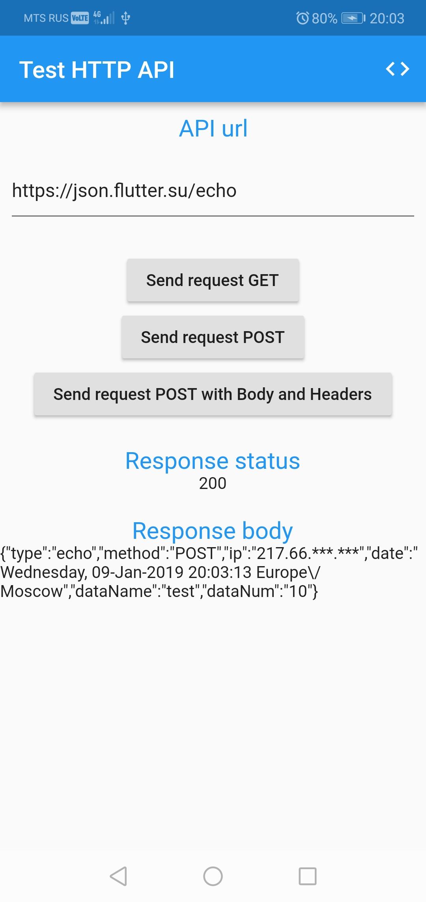
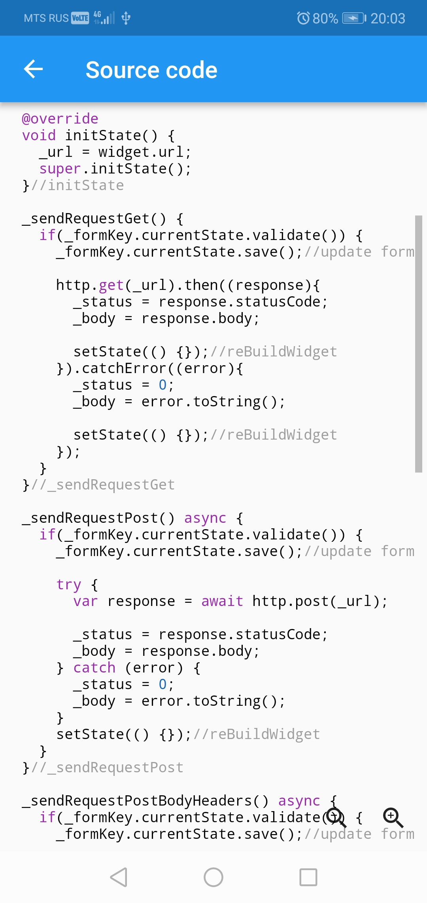

# flutter_test_http

Flutter application to check HTTP requests to API server http://json.flutter.su or any other.

## Getting Started

You can:
- git clone https://github.com/flutter-tutorial/test_http.git
- download zip 

For help API, view our
[Manual: TEST HTTP API](https://json.flutter.su/)
[Flutter Lesson 7. HTTP and HTTPS network requests to Dart and Flutter](https://flutter.su/tutorial/7-HTTP-network-requests)

